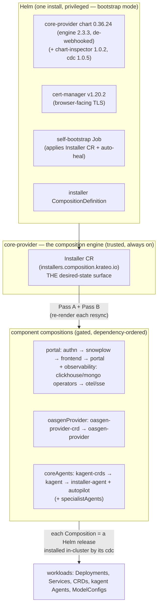
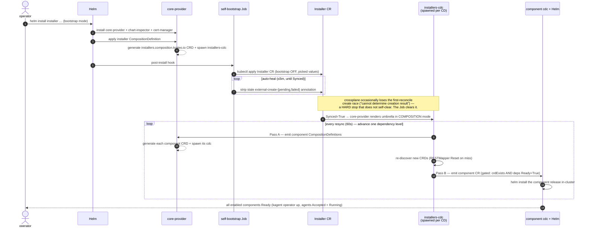
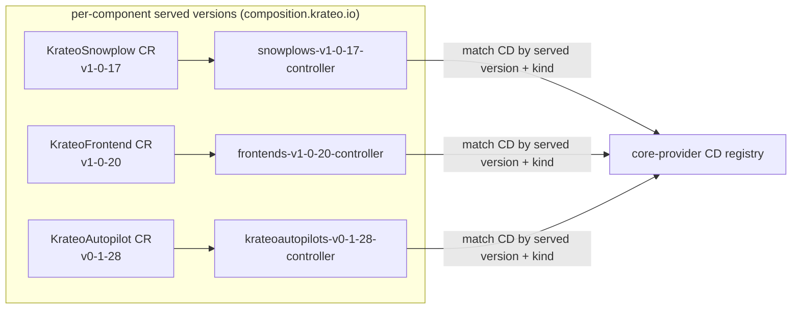
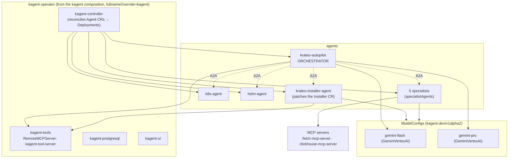
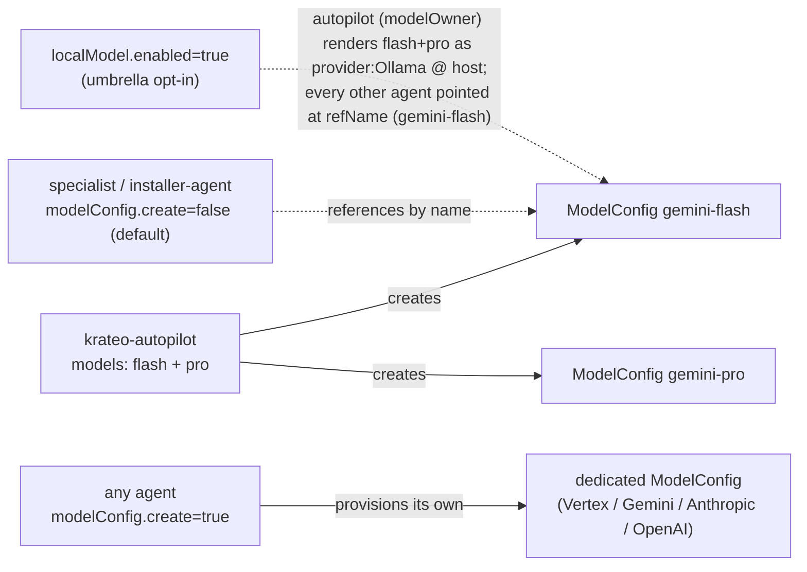
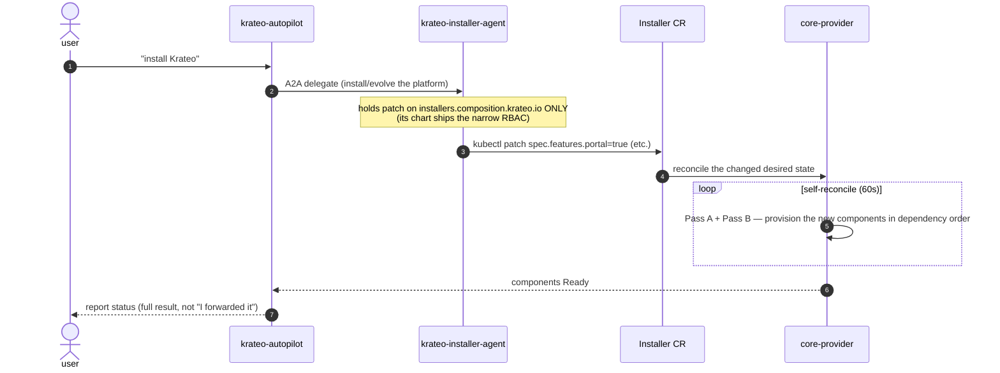
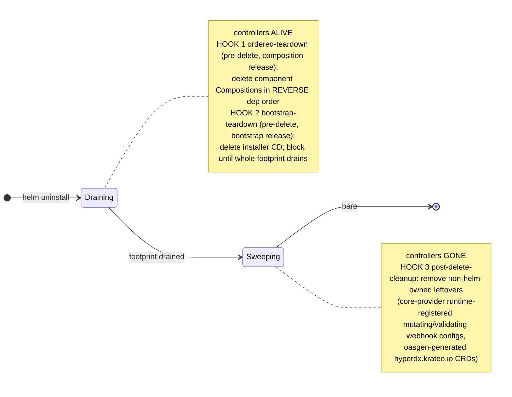

# Krateo Installer — Architecture

Deep dive into how the umbrella installs and runs the platform: the layers, the self-bootstrap +
self-reconcile machinery (with the hands-off auto-heal and the cdc resync), the per-component
CompositionDefinition lifecycle, the core-provider `2.x` engine internals, the agent runtime, and
the ModelConfig surface. For the install commands see **[QUICKSTART.md](./QUICKSTART.md)**; for the
two render modes + teardown see **[README.md](./README.md)**.

Current pins: installer `0.2.145` · core-provider chart `0.36.24` (engine appVersion **`2.3.3`** —
de-webhooked, `MutatingAdmissionPolicy`, requires **k8s ≥ 1.36**; cdc `1.0.5` · chart-inspector
`1.0.2`) · autopilot `0.1.28` · cert-manager `v1.20.2`.

---

## 1. Layers — compose of compositions

One `helm install` is the only privileged action. Everything below the Helm line is driven by the
trusted engine reacting to one declarative CR.

**The seam:** `helm install` renders **bootstrap mode** (`bootstrap.coreProvider.enabled: true`);
core-provider then re-renders the *same chart* in **composition mode** (`false`) on its reconcile
loop. That re-render is the self-reconcile — no `helm upgrade`, no `up.sh`.

---

## 2. Self-bootstrap & self-reconcile — sequence

How one command becomes a running platform, with **no manual `kubectl`** (validated end-to-end).

Two failure modes this design defeats, both **without operator intervention**:

| Symptom | Cause | Fix (where) |
|---|---|---|
| Installer CR stuck `Synced=False`, "cannot determine creation result" | crossplane create-pending race on first reconcile | self-bootstrap Job auto-heal loop (`self-bootstrap.yaml`) |
| Rollout stalls — next dependency level never emitted | cdc's RESTMapper cached, doesn't see freshly-generated CRDs | cdc `1.0.5` `Reset()`s on a cache miss + `COMPOSITION_CONTROLLER_RESYNC_INTERVAL=60s` (core-provider chart) |

---

## 3. Per-component CompositionDefinition lifecycle — FSM

Every component (e.g. `kagent-crds`, `authn`, `krateo-autopilot`) walks this independently. Pass A
and Pass B are gated; the resync loop re-evaluates the gates until the whole DAG is `Ready`.

```mermaid
stateDiagram-v2
    direction TB
    [*] --> Defined: Pass A emits the component CompositionDefinition
    Defined --> CRDGen: core-provider reconciles the CD
    CRDGen --> ControllerUp: CRD generated (served version composition.krateo.io/v<component-chartver> / <Kind>) + cdc Deployment spawned

    state "external-create race?" as race
    ControllerUp --> race
    race --> AutoHeal: pending annotation stuck (first-reconcile)
    AutoHeal --> CDReady: annotation cleared → Synced=True
    race --> CDReady: clean create

    CDReady --> Gated: CD Ready=True; Pass B may emit the CR
    Gated --> Waiting: deps NOT all Ready  (or CRD not yet discoverable)
    Waiting --> Gated: next resync re-evaluates (cdc re-discovers CRDs)
    Gated --> CREmitted: crdExists=true AND depsReady=true → Pass B emits the component CR
    CREmitted --> Installing: the component's cdc helm-installs the release
    Installing --> Ready: workload up, status Ready=True
    Ready --> [*]
```

- **Pass A gate:** register the component CompositionDefinition if the feature flag
  (`features.<flag>`) is enabled **OR** its Composition still exists (`inst.compositionExists`) — the
  latter keeps the CD/CRD alive while a feature-disabled component drains.
- **Pass B gates** (`_helpers.tpl`): when the feature is ON, emit the CR once
  `inst.crdExists(kind,version)` (the exact served version exists) **and** `inst.depsReady` (every
  `deps` entry reports `Ready=True`). Both are live `lookup`s — which is why advancement depends on the
  cdc re-discovering CRDs each resync. When the feature is OFF, Pass B flips to a **reverse-dependency
  drain**: it keeps rendering the CR while `crdExists AND NOT inst.dependentsGone` (leaves-first
  teardown). Each emitted CR carries the label `krateo.io/release-name = <component>` so cdc reuses the
  existing Helm release across delete+recreate.

---

## 4. Engine internals — core-provider `2.x` (de-webhooked) + multi-version CRD model

**De-webhooked (2.x; engine appVersion `2.3.3`, chart `0.36.24`).** Unlike the 1.x line (which ran a
`/mutate` admission webhook + a conversion webhook backed by a CSR-issued serving cert), core-provider
**2.x** stamps the composition-version label through an in-apiserver `MutatingAdmissionPolicy` +
`Binding` (`admissionregistration.k8s.io/v1`, **GA in Kubernetes 1.36**) — a CEL rule sets
`labels["krateo.io/composition-version"] = request.requestKind.version` — and uses `NoneConverter`
CRDs. No webhook server, no CSR, no `MutatingWebhookConfiguration`, no serving cert, no cert-manager
dependency for the engine itself. **This is why the installer requires k8s ≥ 1.36** (the GA
`MutatingAdmissionPolicy` must also exist in any remote target clusters). It also means GKE Autopilot's
Warden, which blocks the `system:node` CSR the 1.x webhook needed, is no longer a blocker for the
engine — though the full platform still wants Standard for other reasons.

**Multi-version CRD model.** Each component pins its **OWN** chart version, and the served CRD
apiVersion is derived per-component as `composition.krateo.io/v<ver-with-dots-as-dashes>` (the
`inst.apiVersion` helper; e.g. snowplow `1.0.17` → `v1-0-17`, frontend `1.0.20` → `v1-0-20`). There is
**one served version per composition-version**, plus a permanent **"vacuum"** storage version — the
stable storage version kept across all served versions. The old engine (`0.26.1`) couldn't tell apart
multiple Kinds that *shared* one chart version and stalled ("too many definitions"); core-provider
resolves a CR → its CompositionDefinition by **version *and* kind**, and names each spawned controller
by **resource + version**:

**Served-version pruning (#103).** core-provider drives pruning from `Observe`: once no composition
references a stale served version, that version is removed from `spec.versions[]`. It first trims
`status.storedVersions` before dropping a version (the apiserver forbids removing a still-stored
version) — which is why the engine ClusterRole grants `customresourcedefinitions/status` as a SEPARATE
`*` grant. Composition instances carry the label `krateo.io/composition-version` set to the served
version they were written through.

The helpers tolerate the transient where a `Kind` exists but the new served version lags after a
version bump: `inst.crdExists` checks `spec.versions[].served` for the **exact** wanted v-name (treats
not-yet-served as "not ready"), and all typed lookups (`inst.ready` / `inst.dependentsGone` /
`inst.compositionExists`) short-circuit through `inst.crdExists` first — because a typed lookup of an
unserved Kind is a hard 500 in chart-inspector.

> Requirement, not optional: the installer **must** run core-provider **2.x** (it pins chart
> `0.36.24`, engine `2.3.3`). On `0.26.1` any namespace with >1 component at one chart version
> deadlocks ("too many definitions"). cdc controllers are named `{resource}-{served-version}-controller`
> via the spawn-template ConfigMap (`assets/cdc/configmap.yaml`).

---

## 5. Agent runtime topology

`coreAgents` brings up the base agent layer; `specialistAgents` adds the 5 component experts.
`krateo-autopilot` is the single orchestrator — every other agent is an **A2A sub-agent**, and tools
come from **RemoteMCPServers**. The kagent operator reconciles each `Agent` CR into a Deployment.

Notes that bite if wrong:
- **Tool-server name.** Agents reference `RemoteMCPServer/kagent-tool-server` by the kagent
  default-install convention. The kagent composition sets `kagentapp.fullnameOverride=kagent` so the
  server is named `kagent-tool-server` (not `kagent-<release-hash>-tool-server`).
- **extraAgents gating.** The autopilot ships **standalone by default**
  (`componentValues.krateo-autopilot.extraAgents: []`) — it answers questions and reports status but
  does not auto-orchestrate the fleet. To opt into A2A orchestration you list specialist agents in
  `extraAgents`; that list is then filtered (`compositions.yaml`) to the agents whose component feature
  is enabled, so kagent never fails to compile a missing one ("Agent … not found").
- **k8s-agent prompt.** The autopilot chart ships `prompts/k8s_agent` (added `0.1.11`).
- **kagent-ui exposure.** The UI Service is nested at `kagentapp.ui.service` (not the chart
  top-level `service`), so the umbrella exposes it via the kagent component's `serviceValuesPath:
  kagentapp.ui.service` — when `exposure.type=LoadBalancer`/`NodePort` the exposure layer flips that
  Service while the kagent chart keeps its ClusterIP default. Plain-HTTP is safe on kagent ≥ 0.9.7.
- **Adding an agent / dynamic spawn.** The autopilot only routes to agents in its `type: Agent` tool
  list (installer-built from enabled components). A bare `kubectl apply` of an `Agent` CR spawns a
  running, directly-A2A-reachable agent but does **not** make it orchestrated — see
  **[ADDING-AN-AGENT.md](./kagent/ADDING-AN-AGENT.md)**.

---

## 6. ModelConfig resolution

Each agent's model is configured through `componentValues.<agent>.modelConfig` — independent of the
global `vertexAI` defaults. See *Give an agent a different model* in the QUICKSTART.

**Ownership topology (the seam for any model change):** the **autopilot OWNS** the two shared
ModelConfigs `gemini-flash` + `gemini-pro`; the installer-agent and all 5 specialists reference them
**by name** with `create:false`. So flipping those two flips the whole fleet — which is exactly how
the opt-in **`localModel`** path works (default off; `vertexAI` stays the default):

> **Local LLM in one flag.** `--set localModel.enabled=true --set localModel.host=<ollama-url>
> --set localModel.model=qwen3.6` makes `compositions.yaml` inject `localModel` into the autopilot
> (the `modelOwner`) so it renders `gemini-flash`/`gemini-pro` as `provider: Ollama`, and points every
> other agent at `refName` (`create:false`) — the entire fleet runs on the local model, no
> per-agent-chart change, `vertexAI` injection suppressed. Use a **tool-calling-capable** model
> (qwen3.6 recommended; gemma ≤3 cannot tool-call). See
> [QUICKSTART — local model](./QUICKSTART.md#run-the-agent-layer-on-a-local-model-ollama).

`modelConfig` fields (strictly typed in `componentValues`; `additionalProperties:false`):

| field | meaning |
|---|---|
| `name` | the ModelConfig the agent's `Agent` CR references |
| `create` | `false` = reference an existing one by `name`; `true` = provision a dedicated one |
| `provider` | **enum** — `Anthropic · OpenAI · AzureOpenAI · Ollama · Gemini · GeminiVertexAI · AnthropicVertexAI · Bedrock · SAPAICore` (the kagent CRD list; a typo is rejected at `helm install`) |
| `model` | model id |
| `vertexAI.{projectID,location}` | used when `provider: GeminiVertexAI` |
| `apiKeySecret` / `apiKeySecretKey` | Secret + key, for key-based providers |

The `provider` enum is enforced both in each agent chart's `values.schema.json` and centrally by
`hack/gen-componentvalues-schema.py` (it injects the enum while regenerating, so the installer
enforces it even for an agent whose OCI chart predates the enum).

---

## 7. "The autopilot installs Krateo" — sequence

The agent-only profile's whole point: a human bootstraps the agent layer once; the **agent** then
provisions the platform by editing one CR (it never needs cluster-admin). See
**[kagent/AGENT-DRIVEN-PROVISIONING.md](./kagent/AGENT-DRIVEN-PROVISIONING.md)**.

The apiserver **validates every patch** against the `Installer` CRD (generated from
`values.schema.json`), so the agent literally cannot write invalid platform config — its blast
radius is *valid installer settings only*.

---

## 8. Teardown — three-hook FSM

`helm uninstall` gives no ordering guarantee that a finalizing controller outlives what it
finalizes. The fix uses the Helm rule that **all `pre-delete` hooks complete before any normal
resource is deleted** (controllers still alive), plus a `post-delete` sweep. Full detail in the
README; the order:

