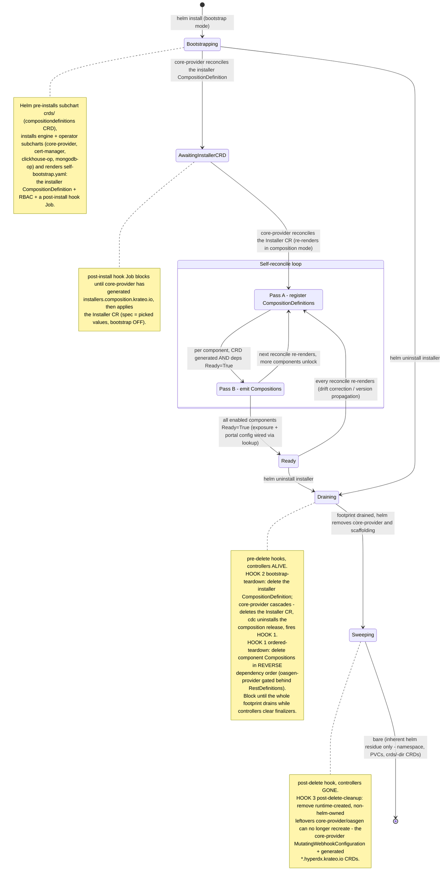
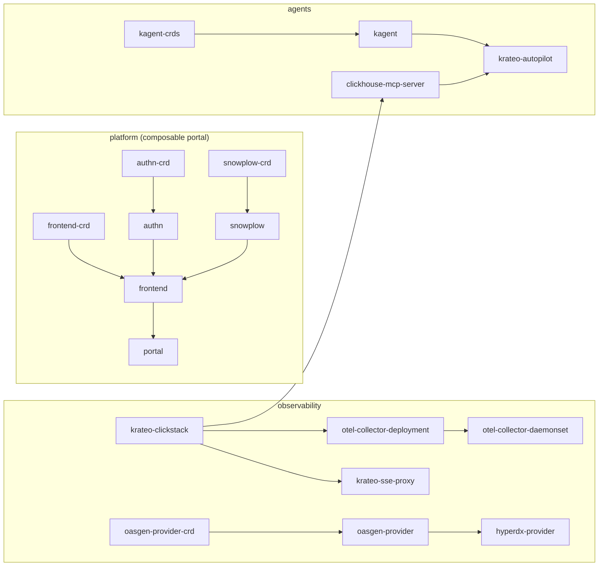

# Krateo PlatformOps Installer (umbrella)

A **compose-of-compositions** blueprint that installs the entire Krateo PlatformOps platform
from **one `helm install`**. The umbrella self-bootstraps the composition engine, registers
itself as an `Installer` composition, and then self-reconciles: it registers each component's
`CompositionDefinition` (Pass A) and emits each `Composition` once its dependencies are
`Ready` and its CRD exists (Pass B), resolving exposure (`service.type`) and the portal config
(peer LoadBalancer IPs) by reconciliation — no prerequisite scripts, no post-install patching.

- **Chart:** `oci://ghcr.io/braghettos/charts/installer`
- **Install guide:** see **[QUICKSTART.md](./QUICKSTART.md)** — kind (with MetalLB) and managed GKE.
- **Kind:** `Installer` (`composition.krateo.io`).

```bash
helm install installer oci://ghcr.io/braghettos/charts/installer --version 0.2.47 \
  -n krateo-system --create-namespace --set exposure.type=LoadBalancer --wait
# tear the whole platform down (ordered, finalizer-safe, no manual cleanup):
helm uninstall installer -n krateo-system
```

## How it works — the two render modes

The umbrella chart renders **differently depending on `bootstrap.coreProvider.enabled`**, which
is the seam between "a plain Helm install" and "the Krateo composition engine":

| | **Bootstrap mode** (`bootstrap.coreProvider.enabled: true`, the `helm install`) | **Composition mode** (`false`, core-provider re-rendering the Installer CR) |
|---|---|---|
| `self-bootstrap.yaml` | ✅ renders — `installer` CompositionDefinition + RBAC + post-install hook | — |
| subchart deps (`Chart.yaml`) | ✅ installed — core-provider, cert-manager, clickhouse-op, mongodb-op | — |
| `definitions.yaml` (Pass A) | — | ✅ one CompositionDefinition per enabled component |
| `compositions.yaml` (Pass B) | — | ✅ one Composition per component (gated on CRD + deps Ready) |
| `secret.yaml` | — | ✅ component secrets (e.g. gemini key) |
| teardown hooks | `bootstrap-teardown` (pre-delete) + `post-delete-cleanup` | `ordered-teardown` (pre-delete) |

One `helm install` runs **bootstrap mode**. core-provider then reconciles the `Installer` CR by
re-rendering this same chart in **composition mode** on its reconcile loop — that is the
self-reconcile that advances the rollout with no `helm upgrade`/`up.sh`.

## Lifecycle — state machine



### Why the teardown is split across three hooks

Krateo cleans up via **finalizers only a live controller can clear**, but `helm uninstall`
gives no ordering guarantee that a finalizing controller outlives what it finalizes. The fix
uses one Helm property — **all `pre-delete` hooks run to completion before any normal resource
is deleted, so controllers are still alive inside them** — plus a `post-delete` hook for what's
left once they're gone:

1. **`ordered-teardown.yaml`** (pre-delete, composition release) — deletes component
   `Composition` CRs in **reverse dependency order** (consumers before providers), so the portal
   drains before `frontend-crd`/`authn-crd`/`snowplow-crd` and `hyperdx-provider` drains before
   `oasgen-provider`. Fixes the portal/`demo-system` wedge and the RestDefinition orphan.
2. **`bootstrap-teardown.yaml`** (pre-delete, bootstrap release) — deletes the top-level
   `installer` CompositionDefinition and **blocks until the whole footprint drains** while
   core-provider is alive (so it GCs the generated CRDs and clears the installer CD finalizer).
   Fixes the bootstrap finalizer deadlock and the orphaned per-composition cdc Deployment.
3. **`post-delete-cleanup.yaml`** (post-delete, bootstrap release) — sweeps **runtime-created,
   non-helm-owned** resources core-provider/oasgen left behind (the core-provider
   `MutatingWebhookConfiguration`, generated `*.hyperdx.krateo.io` CRDs) so a subsequent
   reinstall does not crashloop.

## Component dependency graph

The `components` list in `values.yaml` is **topologically sorted** (dependencies before
dependents). Pass B emits each Composition only once every entry in its `deps` reports
`Ready=True`; teardown walks the **reverse** of this order.



## Layout

```
chart/                            the umbrella chart
  Chart.yaml                      bootstrap subchart deps (core-provider, cert-manager, ...)
  values.yaml                     spec surface + the components list (versions, deps, tiers)
  values.schema.json              full schema for the Installer spec
  templates/
    self-bootstrap.yaml           bootstrap mode: installer CD + RBAC + post-install hook
    definitions.yaml              Pass A - emit component CompositionDefinitions
    compositions.yaml             Pass B - emit gated Compositions + exposure/config wiring
    secret.yaml                   component secrets
    ordered-teardown.yaml         HOOK 1 - pre-delete reverse-dependency drain
    bootstrap-teardown.yaml       HOOK 2 - pre-delete full-footprint drain
    post-delete-cleanup.yaml      HOOK 3 - post-delete orphan sweep
    _helpers.tpl                  inst.* helpers (apiVersion, crdExists, depsReady, lbip, ...)
compositiondefinition.yaml        install the umbrella itself as a CompositionDefinition (advanced)
```

## Releasing

Pushing a semver tag triggers `.github/workflows/release-oci.yaml`, which packages and pushes
`chart/` to `oci://ghcr.io/braghettos/charts/installer:<tag>` (`CHART_VERSION` is substituted
from the tag). Component charts live in their own `braghettos/*` repos and publish the same way.
