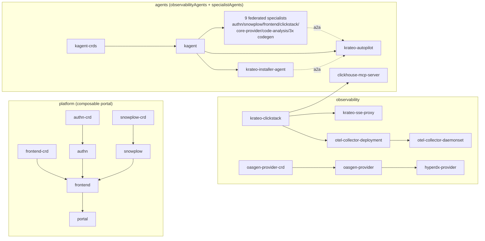

# Krateo PlatformOps Installer (umbrella)

A **compose-of-compositions** blueprint that installs the entire Krateo PlatformOps platform
from **one `helm install`**. The umbrella self-bootstraps the composition engine, registers
itself as an `Installer` composition, and then self-reconciles: it registers each component's
`CompositionDefinition` (Pass A) and emits each `Composition` once its dependencies are
`Ready` and its CRD exists (Pass B), resolving exposure (`service.type`) and the portal config
(peer LoadBalancer IPs) by reconciliation — no prerequisite scripts, no post-install patching.

- **Chart:** `oci://ghcr.io/braghettos/krateo/installer` (current: **`0.2.87`**)
- **Install guide:** see **[QUICKSTART.md](./QUICKSTART.md)** — kind (local) and managed GKE.
- **Kind:** `Installer` (`composition.krateo.io`).
- **Engine:** core-provider **2.0.x** (app `2.0.2`, **de-webhooked** — uses `MutatingAdmissionPolicy`, GA in **k8s ≥ 1.36**, instead of a mutating webhook), pinned by the `krateo-core-provider` bootstrap subchart `0.36.7`. Requires **Kubernetes ≥ 1.36**.
- **Expert agent:** a kagent `Agent` that knows this blueprint — see **[kagent/](./kagent)** and the [agent-driven guide](./kagent/AGENT-DRIVEN-PROVISIONING.md).

There are two ways to install, both from **one `helm install`**:

```bash
# (A) FULL platform — every component (authn -> snowplow -> frontend -> portal, oasgen,
#     observability, all agents) provisioned by the umbrella's self-reconcile loop:
helm install installer oci://ghcr.io/braghettos/krateo/installer --version 0.2.87 \
  -n krateo-system --create-namespace --set exposure.type=LoadBalancer \
  --set vertexAI.enabled=true --set vertexAI.projectID=<PROJECT>

# (B) AGENT-ONLY — bring up just kagent + the installer-agent + the autopilot, then let the
#     autopilot install the rest of Krateo by editing the Installer CR (see QUICKSTART):
curl -sO https://raw.githubusercontent.com/braghettos/krateo-installer/main/chart/values-agent-only.yaml
helm install installer oci://ghcr.io/braghettos/krateo/installer --version 0.2.87 \
  -n krateo-system --create-namespace -f values-agent-only.yaml \
  --set vertexAI.enabled=true --set vertexAI.projectID=<PROJECT>

# tear the whole platform down (ordered, finalizer-safe, no manual cleanup):
helm uninstall installer -n krateo-system
```

Both are **hands-off**: the self-bootstrap auto-heals the Installer CR's first reconcile and the
composition engine advances the rollout on its resync loop (60s) — no manual `kubectl`.
`vertexAI` powers the agents via Application Default Credentials on GKE (node SA needs
`roles/aiplatform.user` or `roles/editor` + `cloud-platform` scope); on kind set
`--set vertexAI.enabled=false` and supply a Gemini API key Secret instead. To run the **whole
agent fleet on a local LLM** (no cloud), add `--set localModel.enabled=true --set
localModel.host=<ollama-url> --set localModel.model=qwen3.6` — see
[QUICKSTART — local model](./QUICKSTART.md#run-the-agent-layer-on-a-local-model-ollama).

## How it works — the two render modes

The umbrella chart renders **differently depending on `bootstrap.coreProvider.enabled`**, which
is the seam between "a plain Helm install" and "the Krateo composition engine":

| | **Bootstrap mode** (`bootstrap.coreProvider.enabled: true`, the `helm install`) | **Composition mode** (`false`, core-provider re-rendering the Installer CR) |
|---|---|---|
| `self-bootstrap.yaml` | ✅ renders — `installer` CompositionDefinition + RBAC + post-install hook | — |
| subchart deps (`Chart.yaml`) | ✅ installed — core-provider, cert-manager, clickhouse-op, mongodb-op | — |
| `definitions.yaml` (Pass A) | — | ✅ one CompositionDefinition per enabled component |
| `compositions.yaml` (Pass B) | — | ✅ one Composition per component (gated on CRD + deps Ready) |
| `secret.yaml` | — | ✅ component secrets (e.g. gemini key) |
| teardown hooks | `bootstrap-teardown` (pre-delete) + `post-delete-cleanup` | `ordered-teardown` (pre-delete) |

One `helm install` runs **bootstrap mode**. core-provider then reconciles the `Installer` CR by
re-rendering this same chart in **composition mode** on its reconcile loop — that is the
self-reconcile that advances the rollout with no `helm upgrade`/`up.sh`.

## Lifecycle — state machine

```mermaid
stateDiagram-v2
    direction TB
    [*] --> Bootstrapping: helm install (bootstrap mode)

    note right of Bootstrapping
        Helm pre-installs subchart crds/ (compositiondefinitions CRD),
        installs engine + operator subcharts (core-provider, cert-manager,
        clickhouse-op, mongodb-op) and renders self-bootstrap.yaml:
        the installer CompositionDefinition + RBAC + a post-install hook Job.
    end note

    Bootstrapping --> AwaitingInstallerCRD: core-provider reconciles the installer CompositionDefinition

    note right of AwaitingInstallerCRD
        post-install hook Job blocks until core-provider has
        generated installers.composition.krateo.io, then applies
        the Installer CR (spec = picked values, bootstrap OFF).
        AUTO-HEAL: the same Job then strips any stale crossplane
        krateo.io/external-create-{pending,failed} annotation off the
        Installer CR until it goes Synced (the cdc occasionally loses
        the first-reconcile create race) - so the install is hands-off.
    end note

    AwaitingInstallerCRD --> PassA: Installer CR Synced -> core-provider re-renders in composition mode

    state "Self-reconcile loop (cdc resync = 60s)" as Loop {
        PassA: Pass A - register component CompositionDefinitions
        PassB: Pass B - emit component CRs (gated)
        PassA --> PassB: per component, CRD generated AND deps Ready=True
        PassB --> PassA: next resync re-renders; the cdc re-discovers new CRDs (RESTMapper Reset on miss), unlocking the next dependency level
    }

    PassB --> Ready: all enabled components Ready=True (exposure + portal config wired via lookup)
    Ready --> PassA: every resync re-renders (drift correction / version propagation)

    Ready --> Draining: helm uninstall installer
    Bootstrapping --> Draining: helm uninstall installer

    note right of Draining
        pre-delete hooks, controllers ALIVE.
        HOOK 2 bootstrap-teardown: delete the installer CompositionDefinition;
        core-provider cascades - deletes the Installer CR, cdc uninstalls the
        composition release, fires HOOK 1.
        HOOK 1 ordered-teardown: delete component Compositions in REVERSE
        dependency order (oasgen-provider gated behind RestDefinitions).
        Block until the whole footprint drains while controllers clear finalizers.
    end note

    Draining --> Sweeping: footprint drained, helm removes core-provider and scaffolding

    note right of Sweeping
        post-delete hook, controllers GONE.
        HOOK 3 post-delete-cleanup: remove runtime-created, non-helm-owned
        leftovers core-provider/oasgen can no longer recreate - the
        core-provider MutatingWebhookConfiguration + generated
        *.hyperdx.krateo.io CRDs.
    end note

    Sweeping --> [*]: bare (inherent helm residue only - namespace, PVCs, crds/-dir CRDs)
```

### Why the teardown is split across three hooks

Krateo cleans up via **finalizers only a live controller can clear**, but `helm uninstall`
gives no ordering guarantee that a finalizing controller outlives what it finalizes. The fix
uses one Helm property — **all `pre-delete` hooks run to completion before any normal resource
is deleted, so controllers are still alive inside them** — plus a `post-delete` hook for what's
left once they're gone:

1. **`ordered-teardown.yaml`** (pre-delete, composition release) — deletes component
   `Composition` CRs in **reverse dependency order** (consumers before providers), so the portal
   drains before `frontend-crd`/`authn-crd`/`snowplow-crd` and `hyperdx-provider` drains before
   `oasgen-provider`. Fixes the portal/`demo-system` wedge and the RestDefinition orphan.
2. **`bootstrap-teardown.yaml`** (pre-delete, bootstrap release) — deletes the top-level
   `installer` CompositionDefinition and **blocks until the whole footprint drains** while
   core-provider is alive (so it GCs the generated CRDs and clears the installer CD finalizer).
   Fixes the bootstrap finalizer deadlock and the orphaned per-composition cdc Deployment.
3. **`post-delete-cleanup.yaml`** (post-delete, bootstrap release) — sweeps **runtime-created,
   non-helm-owned** resources core-provider/oasgen left behind (the core-provider
   `MutatingWebhookConfiguration`, generated `*.hyperdx.krateo.io` CRDs) so a subsequent
   reinstall does not crashloop.

## Component dependency graph

The `components` list in `values.yaml` is **topologically sorted** (dependencies before
dependents). Pass B emits each Composition only once every entry in its `deps` reports
`Ready=True`; teardown walks the **reverse** of this order.



> **observabilityAgents** = the minimal layer (`kagent-crds` → `kagent` → `krateo-installer-agent`
> + `krateo-autopilot`) — the agent-only profile. **specialistAgents** adds the 9 federated
> component experts + `clickhouse-mcp-server`. The autopilot is the single orchestrator; every other
> agent registers on it as an A2A sub-agent (`componentValues.krateo-autopilot.extraAgents`, gated
> to the agents actually enabled). Deep dive — topology, ModelConfigs, the hands-off bootstrap
> sequence, and the engine internals: **[ARCHITECTURE.md](./ARCHITECTURE.md)**. Adding your own
> autopilot-orchestrated agent: **[kagent/ADDING-AN-AGENT.md](./kagent/ADDING-AN-AGENT.md)**.

## Layout

```
chart/                            the umbrella chart
  Chart.yaml                      bootstrap subchart deps (core-provider, cert-manager, ...)
  values.yaml                     spec surface + the components list (versions, deps, tiers)
  values.schema.json              full schema for the Installer spec
  templates/
    self-bootstrap.yaml           bootstrap mode: installer CD + RBAC + post-install hook
    definitions.yaml              Pass A - emit component CompositionDefinitions
    compositions.yaml             Pass B - emit gated Compositions + exposure/config wiring
    secret.yaml                   component secrets
    ordered-teardown.yaml         HOOK 1 - pre-delete reverse-dependency drain
    bootstrap-teardown.yaml       HOOK 2 - pre-delete full-footprint drain
    post-delete-cleanup.yaml      HOOK 3 - post-delete orphan sweep
    _helpers.tpl                  inst.* helpers (apiVersion, crdExists, depsReady, lbip, ...)
compositiondefinition.yaml        install the umbrella itself as a CompositionDefinition (advanced)
```

## Releasing

Pushing a semver tag triggers `.github/workflows/release-oci.yaml`, which packages and pushes
`chart/` to `oci://ghcr.io/braghettos/krateo/installer:<tag>` (`CHART_VERSION` is substituted
from the tag) plus the federated `krateo-installer-agent` (`kagent/chart`). Component charts live
in their own `braghettos/krateo-*` repos and publish to the same consolidated `/krateo` registry.

**When you change a component's pinned version** (in `chart/values.yaml`), regenerate the typed
`componentValues` schema before tagging:

```bash
python3 hack/gen-componentvalues-schema.py chart   # pulls each pinned component chart's
                                                   # values.schema.json into componentValues.<name>
```

The installer version is the unit that manages component **GVRs**: a component's version sets its
Composition's served apiVersion + schema, and `values.schema.json` types `componentValues` against
those exact schemas — so a new component GVR ships as a new installer version with a regenerated
schema, never an in-place edit of a running install.
