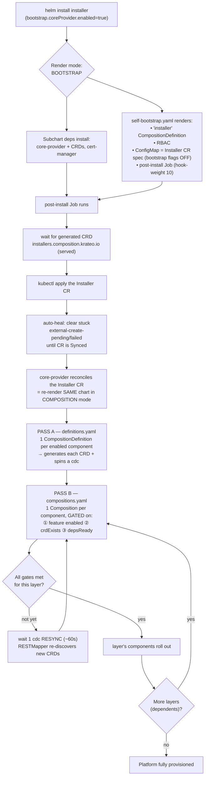

# Krateo Installer — Installation Workflow

> How the Krateo PlatformOps platform is installed from **one `helm install`**, with **no manual
> steps** — no `up.sh`, no prerequisite scripts, no follow-up `helm upgrade` to roll out
> components. The umbrella chart renders in **two modes** and drives the whole rollout itself.
>
> The observability operators (ClickHouse + MongoDB) are **composition components** gated on the
> `portal` feature — so enabling `portal` installs the operators *first*, then the data layer, then
> the stack (rather than relying on bootstrap-only subcharts). cert-manager and the composition
> engine (core-provider) remain bootstrap subcharts.

## The one principle

There is one entry point (`helm install`) and one source of truth (the `Installer` CR). The
umbrella chart:

1. **bootstraps** the composition engine and registers *itself* as an `Installer` composition, then
2. **self-reconciles** — core-provider re-renders the same chart in composition mode and rolls out
   every enabled component in dependency order.

The chart renders differently depending on `bootstrap.coreProvider.enabled`:

- **Bootstrap mode** (`true`, the actual `helm install`): subchart deps + `self-bootstrap.yaml`.
- **Composition mode** (`false`, core-provider re-rendering the CR): `definitions.yaml` (Pass A) +
  `compositions.yaml` (Pass B) + `secret.yaml`.

One `helm install` runs bootstrap mode; core-provider then re-renders this same chart in composition
mode on its reconcile loop — that is the self-reconcile.

## Flow



## Phase by phase

### 1 — `helm install` (bootstrap mode)
`bootstrap.coreProvider.enabled=true` — **set this explicitly on the install** (`--set bootstrap.coreProvider.enabled=true`); the chart **defaults it to `false` (composition-safe)** so that a composition-mode re-render whose CR spec is missing the `bootstrap` key can never fall back to bootstrap mode and wedge the install. The umbrella installs its subchart dependencies —
the composition engine **core-provider** (+ its CRDs) and **cert-manager** — and renders
`self-bootstrap.yaml` only. `definitions.yaml` / `compositions.yaml` / `secret.yaml` do **not**
render here, so the bootstrap release never double-owns them.

### 2 — Self-bootstrap hook (`post-install` Job, hook-weight 10)
The `installers.composition.krateo.io` CRD is *generated at runtime* by core-provider from the
`installer` CompositionDefinition, so it cannot be a templated resource (Helm `lookup` is
render-time and can't see a CRD it is about to create). The Job bridges the gap:

1. waits for the generated CRD to exist **and serve this chart's version**,
2. `kubectl apply`s the **Installer CR** — its spec is the umbrella's own values with **all
   bootstrap flags OFF**,
3. **auto-heals** the first reconcile: core-provider occasionally loses the create race and parks
   the CR on `krateo.io/external-create-pending` / `-failed` ("cannot determine creation result"),
   a hard stop that does not self-clear — the Job strips those annotations until the CR goes
   `Synced`.

This is why the install is fully hands-off — no manual `kubectl`.

### 3 — Self-reconcile (composition mode)
core-provider reconciles the Installer CR by re-rendering the **same chart** with
`bootstrap.coreProvider.enabled=false` — now `definitions.yaml` + `compositions.yaml` +
`secret.yaml` render.

### 4 — Pass A (`definitions.yaml`)
One `CompositionDefinition` per **enabled** component → core-provider generates each component's CRD
and spins a composition-dynamic-controller (cdc).

### 5 — Pass B (`compositions.yaml`) — the dependency engine
One `Composition` per component, emitted only when **three gates** pass:

- ① **feature enabled** — `inst.featureEnabled`
- ② **`inst.crdExists`** — the component's generated CRD serves the version-derived apiVersion
- ③ **`inst.depsReady`** — every dependency Composition is `Ready=True`

Layers unlock as their deps go Ready — **one level per cdc RESYNC (~60s, `COMPOSITION_CONTROLLER_RESYNC_INTERVAL`)**,
as the RESTMapper re-discovers freshly generated CRDs on a cache miss. The result is an automatic,
dependency-ordered rollout.

### Multi-version CRD model (served versions, vacuum storage, pruning)

Each component pins its **own** chart version, and the served CRD apiVersion is derived per-component
as `composition.krateo.io/v<version-with-dots-as-dashes>` (e.g. snowplow `1.0.17` →
`v1-0-17`) — one served version per composition-version. Composition instances are stamped with the
label `krateo.io/composition-version` (= the served version they were written through) by an
in-apiserver **`MutatingAdmissionPolicy` + Binding** (CEL sets the label from
`request.requestKind.version`). This replaces the former `/mutate` admission webhook — there is no
webhook server, no serving cert, and no `MutatingWebhookConfiguration`, which is why core-provider 2.x
requires the GA `admissionregistration.k8s.io/v1` `MutatingAdmissionPolicy` (**k8s ≥ 1.36**, including
in remote target clusters).

A permanent **"vacuum" storage version** (the stable storage version) is kept across all served
versions. **Served-version pruning** (#103) is driven by core-provider from `Observe`: once no
composition references a stale served version it is removed from `spec.versions[]`; the engine first
trims `status.storedVersions` before dropping a version (the apiserver forbids removing a still-stored
version — hence the engine ClusterRole grants `customresourcedefinitions/status` as a separate `*`
grant). The helpers tolerate the transient where a Kind already exists but its new served version
lags after a version bump: `inst.crdExists` checks `spec.versions[].served` for the **exact** wanted
`v-name` (treating not-yet-served as "not ready"), and all typed lookups
(`inst.ready` / `inst.dependentsGone` / `inst.compositionExists`) short-circuit through
`inst.crdExists` first, because a typed lookup of an unserved Kind is a hard 500 in chart-inspector.

## Dependency layering (what unlocks what)

Feature flags select which components participate; `deps` order them within a feature. Illustrative
graph for a full install:

```
core-provider (engine, bootstrap)
        │
   ┌────┴───────────────────────────────────────────────┐
   │ portal (platform)                                   │ portal (observability stack)
   ▼                                                     ▼
 authn-crd ─ authn ─ snowplow-crd ─ snowplow ─ …    clickhouse-operator ─┐
   frontend-crd ─ frontend ─ portal                 mongodb-operator   ──┤
        │  (portal subsumes portal-starter)                              ▼
        │                                              krateo-observability (data layer)
        │                                                                │
        │                                          ┌────────────────┬────┴─────────┐
        │                                          ▼                ▼              ▼
        │                                otel-collector-deployment  sse-proxy  (clickhouse-mcp)
        │                                          ▼
        │                                otel-collector-daemonset

 coreAgents:        kagent-crds ─ kagent ─┬─ krateo-installer-agent ─ krateo-autopilot
                                          └─ fetch-mcp-server
 specialistAgents:  kagent ─ {authn,snowplow,frontend,clickstack,core-provider}-agent + clickhouse-mcp
```

**Observability layer (operators first).** The observability stack ships under the **`portal`**
feature (it is no longer a separate `observability` flag). `krateo-observability` declares
`deps: [clickhouse-operator, mongodb-operator]`. Because Pass B gate ③ requires those deps to be
`Ready=True`, the **operators install first**; only once they are up (CRDs served, controllers
running) does `krateo-observability` create its `ClickHouseCluster` / `KeeperCluster` /
`MongoDBCommunity` CRs — which the operators then reconcile into the actual stateful stores. The
collectors and `sse-proxy` depend on `krateo-observability`, so they come up last, once the data
layer is ready.

## Teardown safety (why operators-as-components is correct)

Krateo cleans up via finalizers that only a **live** controller can clear. The `ordered-teardown`
pre-delete hook deletes component Compositions in **reverse dependency order** (consumers before
providers). Since `krateo-observability` depends on the operators, teardown drains the data-layer
CRs **before** the operators — so the operators stay alive to clear those CRs' finalizers. Correct
ordering is preserved automatically by the dependency graph.

## Install profiles (same workflow, different feature set)

| Profile | Key flags | Result |
|---|---|---|
| **Full platform** | all features on | portal (platform + observability stack) + oasgen-provider + core agents + specialist agents |
| **Agent-only / lean** | `coreAgents` only | kagent + autopilot + installer-agent + fetch-mcp |
| **Register on existing engine** | `bootstrap.coreProvider.enabled=false` | skips the engine subchart; registers the umbrella on a running Krateo |

Switching a feature on/off after install is a single edit to the Installer CR's `spec.features.*`
(merge/apply — it is a CustomResource, so a strategic-merge patch is rejected): core-provider
re-renders and rolls the affected layer forward or drains it, in dependency order.
