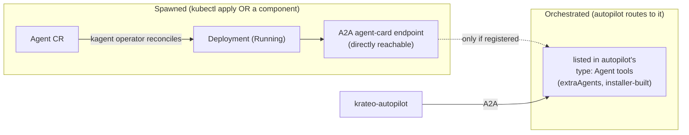

# Adding a new agent orchestrated by the autopilot

How to add a kagent `Agent` so the **`krateo-autopilot`** orchestrator routes to it. There are two
levels, and the difference matters:

- **Spawned** — the kagent operator runs the `Agent` (a Deployment); it is reachable **directly**
  over A2A at its own agent-card endpoint. A plain `kubectl apply` of an `Agent` manifest achieves
  this.
- **Orchestrated** — the **autopilot** routes to it. The orchestrator only delegates to agents that
  appear in **its own `type: Agent` tool list**. On this installer that list is built by
  `compositions.yaml` from the **enabled component set** (`componentValues.krateo-autopilot.extraAgents`,
  filtered to components whose `feature` is on). **Spawning alone does NOT make an agent
  orchestrated** — it must also be registered in that list.

> **Verified on a live cluster (2026-06-16, installer 0.2.87):** `kubectl apply` of a minimal
> `Agent` referencing the autopilot-owned `gemini-flash` ModelConfig reconciled to
> `Accepted=True` → `Ready=True` (1/1) within ~20s. The autopilot's a2a tool list did **not**
> pick it up (it lists only k8s/helm/installer-agent + the 9 specialists); the
> `krateo.io/orchestrated-by: krateo-autopilot` label is **inert today** (label discovery is the
> design end-state in [AUTOPILOT-DESIGN.md §8a](./AUTOPILOT-DESIGN.md), not yet implemented). So
> orchestration is via the installer (`extraAgents`), per Path A below.



---

## Path A — ship it as an installer component (recommended; orchestrated)

This is the standard federated-agent path: the agent ships in a chart, the installer emits it as a
component **and** aggregates it into the autopilot's `extraAgents`, so it is both spawned and
orchestrated, reproducibly, on every install. (See [CHART-STANDARD.md](../CHART-STANDARD.md) for the
`agent` chart shape and [AUTOPILOT-DESIGN.md §7a/§8](./AUTOPILOT-DESIGN.md) for the federation model.)

**1. Package the agent as a chart** (`kagent/chart/` in the relevant component repo, or a standalone
agent repo). Minimum templates: the `Agent` (`agent.yaml`), an optional `ModelConfig`
(`modelconfig.yaml` — set `modelConfig.create=false` to reference the autopilot's `gemini-flash`),
and narrow `rbac.yaml` if the agent's tools mutate the cluster. Publish it to
`oci://ghcr.io/braghettos/krateo/<chart>`.

**2. Add it to the installer's `components`** (`chart/values.yaml`) with its generated Kind, a
`feature` gate, and `deps: [kagent]` so Pass B emits it only after kagent is up:

```yaml
  - name: my-agent
    chart: krateo-my-agent          # omit if the chart name == the component name
    kind: KrateoMyAgent             # the component's generated CRD Kind
    version: "0.1.0"
    deps:
      - kagent
    tier: observability
    feature: specialistAgents       # or a new feature flag
    vertexAI: true                  # marks it an agent: gets vertexAI (or localModel) model wiring + the HITL gate
```

**3. Register it on the orchestrator** via `componentValues.krateo-autopilot.extraAgents` (the
installer is the single aggregator — Helm replaces list overrides, so the whole list lives here):

```yaml
componentValues:
  krateo-autopilot:
    extraAgents:
      - name: my-agent              # must equal the deployed Agent CR's metadata.name
      # …the existing entries…
```

`compositions.yaml` filters `extraAgents` to the agents whose component `feature` is enabled (so a
reference to a disabled agent never makes the orchestrator fail to compile — *"Agent … not found"*).

**4. Regenerate the typed schema and release** (a new component GVR ships as a new installer
version):

```bash
python3 hack/gen-componentvalues-schema.py chart
git tag <next-installer-version> && git push origin <next-installer-version>
```

After the install/upgrade, the autopilot lists `my-agent` in its `type: Agent` tools and routes
matching requests to it.

> **Live in-place add** (no new release, e.g. to demo on a running cluster): patch the `Installer`
> CR `spec.componentValues.krateo-autopilot.extraAgents` **and** add the component to
> `spec.components` — using the **version-qualified GVR** so new fields aren't pruned by the
> preferred (older) served version:
> `kubectl patch installers.v<ver>.composition.krateo.io installer -n krateo-system --type=json -p '[…]'`
> (see [installer upgrade nudges](../README.md) / the project memory). core-provider re-renders and
> the autopilot recompiles with the new sub-agent.

---

## Path B — dynamic `kubectl apply` (spawned + directly reachable; NOT auto-orchestrated)

Useful for a quick experiment or a transient agent. The kagent operator reconciles **any** `Agent`
CR into a running Deployment — no helm release, no installer component:

```yaml
# hello-dynamic-agent.yaml  (verified working on installer 0.2.87)
apiVersion: kagent.dev/v1alpha2
kind: Agent
metadata:
  name: hello-dynamic-agent
  namespace: krateo-system
spec:
  type: Declarative
  declarative:
    runtime: python
    modelConfig: gemini-flash          # reference an existing ModelConfig (autopilot-owned)
    systemMessage: |
      You are hello-dynamic-agent, a minimal demo agent applied dynamically via kubectl.
    a2aConfig:
      skills:
        - id: greet
          name: Greet
          description: Greets the user and confirms dynamic creation.
          tags: [demo, dynamic]
          examples:
            - Say hello
```

```bash
kubectl apply -f hello-dynamic-agent.yaml
kubectl get agent hello-dynamic-agent -n krateo-system -w   # -> Accepted=True, then Ready=True (1/1)
```

This agent **runs** and is reachable directly via its A2A agent-card. It is **not** orchestrated by
the autopilot until it appears in the orchestrator's `type: Agent` tools. To make it orchestrated,
register it via Path A step 3 (the installer's `extraAgents`) — note the installer's filter only
keeps `extraAgents` that correspond to enabled **components**, so a purely ad-hoc agent stays
direct-only unless you also add it as a component. (The clean future path is label discovery —
`krateo.io/orchestrated-by: krateo-autopilot` + a sync that keeps the orchestrator's a2a list in
step — see [AUTOPILOT-DESIGN.md §8a](./AUTOPILOT-DESIGN.md).)

### Can the autopilot spawn an agent itself?

The autopilot/`krateo-installer-agent` hold `k8s_apply_manifest` (HITL-gated), so the agent *can*
`kubectl apply` an `Agent` CR — i.e. spawn a peer (Path B). But it cannot self-register that peer
into its **own** a2a tools (those are installer-managed; a direct edit of the autopilot `Agent` CR
reverts on the next reconcile). To get an **orchestrated** agent, the autopilot must edit the
`Installer` CR (add the component + `extraAgents`) via the installer-agent — i.e. Path A driven by
the agent. A bare self-`apply` yields a running, direct-only agent, same as Path B above.

---

## Related

- [CHART-STANDARD.md](../CHART-STANDARD.md) — the `agent` chart shape (`name`/`sources`/metadata)
- [AUTOPILOT-DESIGN.md](./AUTOPILOT-DESIGN.md) — orchestrator + fleet design, federation, label discovery
- [AGENT-DRIVEN-PROVISIONING.md](./AGENT-DRIVEN-PROVISIONING.md) — the installer-agent editing the Installer CR
- [QUICKSTART — local model](../QUICKSTART.md#run-the-agent-layer-on-a-local-model-ollama) — point a new agent at the local Ollama model (reference `gemini-flash`, which the autopilot renders as Ollama when `localModel.enabled`)
