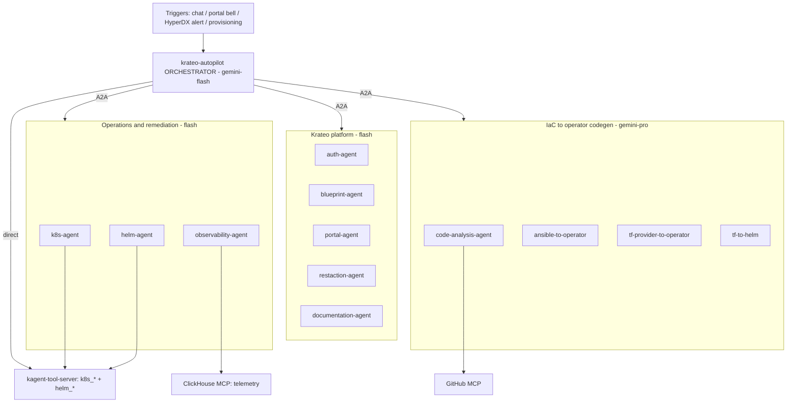
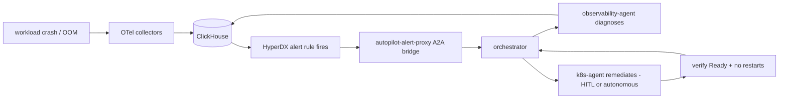

# Autopilot agent system — design

Design for the **`krateo-autopilot`** multi-agent system: the orchestrator and the specialist
agents it routes to, the tools/telemetry they share, how the closed remediation loop is
triggered, and how the autopilot provisions/operates the platform through the `Installer` CR.

> Implementation lives in the **`krateo-autopilot`** chart (a Krateo composition deployed by this
> installer when `features.observabilityAgents=true`); kagent (operator + `kagent-tool-server`) is
> a sibling composition. This document is the architecture + roadmap for the next phase of work.

## 1. Where we are today

`krateo-autopilot` already ships **one orchestrator + 12 specialist agents** (kagent `Agent` CRDs,
Gemini via Vertex AI ADC, no key), grouped in three domains, plus a shared MCP tool layer:

| Agent | Domain | Model | Tools / MCP | Mutating? |
|---|---|---|---|---|
| **krateo-autopilot** (orchestrator) | routing | flash | kagent-tool-server (`k8s_apply_manifest`, `k8s_get_resources`) + A2A to all below | yes (HITL) |
| k8s-agent | ops | flash | kagent-tool-server `k8s_*` | yes (HITL) |
| helm-agent | ops | flash | kagent-tool-server `helm_*` | yes |
| observability-agent | ops | flash | ClickHouse MCP (`list_databases`/`list_tables`/`run_select_query`) + `k8s_*` | no |
| auth / blueprint / portal / restaction / documentation | Krateo platform | flash | k8s read + domain prompts | mostly no |
| code-analysis | IaC | **pro** | GitHub MCP + read | no |
| ansible-to-operator / tf-provider-to-operator / tf-to-helm | IaC codegen | **pro** | GitHub MCP + codegen prompts | no (produces artifacts) |

**Proven**: the closed remediation loop runs end-to-end (OOMKill → OTel → ClickHouse → HyperDX
alert → autopilot → diagnose → `k8s_patch_resource` memory bump → pod Running). **HITL** gates
mutating tools (`requireApproval` when `hitlApproval=true`). The orchestrator's description already
says it *"routes … and installs Krateo"* — tying into agent-driven provisioning (below).

## 2. Goals / non-goals

**Goals.** A coherent agent system that (a) **operates and self-heals** the platform (the closed
loop), (b) is a **Krateo domain expert** (auth/blueprint/portal/restaction/docs), (c) **migrates
IaC → Krateo operators** (the codegen agents), and (d) **provisions/evolves** the platform through
the `Installer` CR — all behind one orchestrator, with HITL gates and an autonomous mode.

**Non-goals.** Replacing kagent or building a new agent runtime; per-tenant agents; anything that
needs cluster-admin for the agents (provisioning goes through the typed `Installer` CR — see
[AGENT-DRIVEN-PROVISIONING.md](./AGENT-DRIVEN-PROVISIONING.md)).

## 3. Architecture decisions

### 3.1 Orchestrator + specialists over A2A

**INVARIANT — `krateo-autopilot` is the single mandatory entry point.** Every interaction with the
agent system goes through the orchestrator; **no specialist is addressed directly** and **no
standalone agent exists outside the fleet.** Specialists are reachable *only* as the orchestrator's
A2A `type: Agent` tools. A "dedicated agent" for any blueprint (including this installer) is
therefore a **registered sub-agent of the autopilot**, not a separately-applied artifact — and it
ships with the platform (Section 7).

The orchestrator is a thin **router** (cheap/fast `gemini-flash`, `stream:true`) that delegates to
specialists via kagent `type: Agent` tools (A2A). It keeps only a minimal direct toolset
(`k8s_get_resources` to triage, `k8s_apply_manifest` for trivial fixes). Specialists own their
domain prompt + toolset, so each stays small and testable. **Rule:** the orchestrator never does
domain work it has a specialist for — it routes.

### 3.2 Model tiering
`gemini-flash` for routing + ops + platform Q&A (latency + cost); `gemini-pro` for the IaC codegen
/ code-analysis agents (reasoning-heavy). One `ModelConfig` per tier, Vertex ADC (no key) on GKE
workload identity. This stays a chart value so a site can swap providers.

### 3.3 Tool/MCP layer
Three MCP backends, declared per-agent via `toolNames` (kagent only exposes a RemoteMCPServer's
tools to the model when `toolNames` are listed):
- **kagent-tool-server** — `k8s_*` + `helm_*` (ops).
- **ClickHouse MCP** — telemetry queries for the observability-agent (Streamable-HTTP at `/mcp`,
  `replicaCount=1` or `sessionAffinity: ClientIP` — sessions are stateful).
- **GitHub MCP** — source access for code-analysis + codegen agents.

### 3.4 HITL / approval
Mutating tools carry `requireApproval` when `hitlApproval=true`. **Known limitation:** approving
across the orchestrator → sub-agent A2A hop fails (*"missing task context"*) — so for gated
mutations the design **invokes the mutating agent single-hop** (orchestrator hands the task to
`k8s-agent` directly and surfaces its approval request) rather than nesting. An **autonomous mode**
(`hitlApproval=false`) drops the gate for trusted closed-loop remediation.

## 4. Entry points / triggers

| Trigger | Path | Status |
|---|---|---|
| Interactive chat | kagent UI / A2A `message/send` → orchestrator | works |
| Portal events bell | sse-proxy events surfaced in the portal (see [[krateo-portal-bell-architecture]]) | works |
| **Closed-loop alert** | HyperDX alert → **(trigger)** → orchestrator → diagnose/remediate/verify | **GAP** |
| Platform provisioning | orchestrator edits the `Installer` CR (features/componentValues) | demonstrated |

**The flagship gap is the alert → autopilot trigger.** Today it relies on an external
`a2a-slack-bot` (not in any repo). Design target: a **first-class in-cluster bridge** — the
HyperDX `Webhook` (already generated by `hyperdx-provider`/oasgen) posts to a small
**`autopilot-alert-proxy`** that translates the alert payload into an A2A `message/send` to the
orchestrator (taskId/contextId per incident). No Slack, no human in the inner loop. This is Phase 1.

## 5. The flagship workflow — closed-loop self-healing

The orchestrator owns the incident: `observability-agent` correlates telemetry (ClickHouse) +
cluster state (`k8s_*`), proposes a fix, `k8s-agent` applies it (gated or autonomous), and the loop
verifies. The remediation is bounded to k8s ops; anything structural (a component misconfig) is
expressed as an `Installer` CR edit (Section 6), not an ad-hoc patch.

## 6. The autopilot as platform operator (provision via the Installer CR)

**Two different installers — do not conflate.** The autopilot's existing `install_krateo` skill +
install prompts target the **upstream krateoplatformops** flow (`helm install …/github-provider`,
`git-provider`, `argocd`, core-provider) — the *old* installer. **This** installer
(`braghettos/installer`) is a completely different mechanism: a self-bootstrapping
compose-of-compositions OCI umbrella whose control surface is the `Installer` CR. Provisioning it is
a **new capability the autopilot does not have today**.

That new capability is [agent-driven provisioning](./AGENT-DRIVEN-PROVISIONING.md): instead of
privileged installs, the autopilot **edits the `Installer` CR** (`spec.features` / `componentValues`
/ `registryAuth`) and core-provider reconciles it (Pass A/B, dependency-ordered — demonstrated: an
`oasgenprovider` toggle provisioned the components in ~3 min). RBAC stays narrow (`patch` on
`installers.composition.krateo.io`), the apiserver's strict schema validates every edit, and
structural changes become declarative + audited rather than imperative `kubectl` mutations.

> **OPEN DECISION:** whether the braghettos umbrella **replaces** the autopilot's old `install_krateo`
> (repoint it to `helm install` the umbrella → drive the `Installer` CR; the installer's own agent
> owns this domain) or **coexists** with it. This determines whether the new installer-agent
> supersedes `install_krateo` or sits beside it.

## 7. Open issues to resolve (carried from build notes)

1. **Alert → autopilot trigger automation** — the `autopilot-alert-proxy` (Phase 1). Highest value.
2. **A2A HITL** — single-hop invoke for gated mutations; or a kagent fix for cross-hop approval.
3. **Autonomous mode** — `hitlApproval=false` as a deliberate, documented switch for the closed loop.
4. **ClickHouse MCP statefulness** — keep `replicaCount=1` (or `sessionAffinity`) so Streamable-HTTP
   sessions don't round-robin (already fixed; keep as an invariant).
5. **kagent sample agents** — stay disabled (they collide with our k8s/helm agents and waste pods).
6. **The installer's dedicated agent is now a fleet specialist, not a standalone artifact**
   (per the §3.1 invariant). The `krateo-installer-expert` knowledge becomes an orchestrated
   sub-agent — a **`krateo-installer-agent`** — that the autopilot routes installer/blueprint
   questions and provisioning intents to (A2A), and it **ships with the platform** rather than
   being `kubectl apply`-ed by hand (Section 7a). The current standalone `kagent/` artifact is
   deprecated in favor of this.

### 7a. Shipping + registering the installer's dedicated agent

To satisfy "orchestrated by autopilot **and** included in the install", two coordinated changes:

- **Ship it with the install.** The `krateo-installer-agent` `Agent` (the installer-expert system
  prompt as its `systemMessage`, with `k8s_*`/`helm_*` tools) is deployed by the platform when
  `features.observabilityAgents=true` (so kagent + the autopilot are present) — i.e. as a templated
  resource the install emits, not a loose file. It reuses the autopilot's `ModelConfig` (Vertex ADC).
- **Register it on the orchestrator.** The autopilot orchestrator must list it as a `type: Agent`
  tool so it's reachable only through routing. Since the orchestrator lives in the `krateo-autopilot`
  chart, this needs **either** (a) the agent added to that chart's fleet (`agents.installerExpert`
  + the `type: Agent` entry, gated by a value), **or** (b) an **`extraAgents` extensibility hook**
  on the orchestrator (a values list of `{name, apiGroup}` the install populates) — preferred,
  because it lets a blueprint contribute its own specialist without forking the autopilot chart.
  The `krateo-installer-agent` Agent CRD itself can live in the installer chart; only its
  *registration* needs the orchestrator's a2a list.

This makes the installer's agent a first-class, autopilot-gated specialist — and gives every future
blueprint the same clean way to contribute a domain agent.

## 8. Extending the fleet (adding an agent)

A new specialist is a uniform change:
1. `agents.<name>` block in `values.yaml` (`enabled`, `modelConfig`).
2. an `Agent` template (prompt key, `a2aConfig.skills`, `tools` + `toolNames`).
3. register it on the orchestrator as a `type: Agent` tool (gated on `agents.<name>.enabled`).
4. a prompt section in `files/prompts-*.yaml`.
5. if it needs new tools, a `RemoteMCPServer` in `mcpServers` + the `toolNames` on the agent.

## 8a. Target architecture — federated agents (agents ship with their components)

**Direction:** specialist agents should live **with the code they're expert in**. Each component
chart ships its own agent — e.g. `frontend-chart` contains the frontend agent, `authn-chart` the
authn agent, `snowplow-chart` the snowplow agent — so deploying a component deploys its specialist,
and the central `krateo-autopilot` orchestrator routes to it (the §3.1 invariant still holds: one
mandatory entry point over a now-**decentralized, component-owned** fleet).

This co-locates domain knowledge with the domain team (the frontend team owns the frontend agent's
prompt + tools), and shrinks the autopilot chart to the **orchestrator + cross-cutting agents only**
(ops: `k8s`/`helm`/`observability`; IaC codegen). The per-domain agents (`auth`, `blueprint`,
`portal`, `restaction`, `documentation`, and new ones) **migrate out** of the autopilot chart into
their component charts.

**How the orchestrator learns the federated fleet** — two stages:

- **Now — installer-aggregates (the `extraAgents` hook, §7a).** A component flagged `agent: true`
  ships its `Agent` CR; the installer's `compositions.yaml` aggregates the enabled agents into the
  autopilot composition's `extraAgents`. Works today. Because Helm replaces list overrides, **one
  aggregator must build the whole list** — the installer is the natural one (it already knows the
  enabled component set).
- **Target — label discovery.** Components ship their agent labeled
  `krateo.io/orchestrated-by: krateo-autopilot`; a small sync (a controller, or a kagent
  enhancement) keeps the orchestrator's `type: Agent` tools in step with the labeled set — **zero
  installer coordination**, components fully self-contained. This is the clean end-state.

A component chart's agent contribution is uniform: the `Agent` CR (inline `systemMessage`, reusing
the platform `ModelConfig` + shared MCP servers, with the right `toolNames`), the `agent: true`
marker / orchestration label, and its prompt — all versioned **with the component**.

## 9. Roadmap

- **Phase 1 — close the loop.** Ship `autopilot-alert-proxy` (HyperDX Webhook → A2A) so remediation
  is fully in-cluster, no Slack. Verify the OOM loop end-to-end with the automated trigger.
- **Phase 2 — autonomy + safe HITL.** Autonomous-mode switch; the single-hop approval pattern for
  gated mutations; per-tool approval policy as chart values.
- **Phase 3 — provisioning operator.** Wire the orchestrator to drive the `Installer` CR (narrow
  RBAC + the strict-schema safety net); incident remediations that are structural become CR edits.
- **Phase 4 — blueprint specialists + the orchestration hook.** Add the `extraAgents` extensibility
  hook to the autopilot orchestrator (§7a), ship the `krateo-installer-agent` with the install and
  register it through that hook (autopilot-gated, no standalone), and harden the IaC codegen agents
  (ansible/tf → operator) and the ClickHouse-telemetry diagnostics. This establishes the standard
  path for *any* blueprint to contribute an autopilot-orchestrated domain agent.
- **Phase 5 — federate the fleet (agents ship with their components).** Migrate the per-domain
  agents out of the autopilot chart into their component charts (`frontend-chart`, `authn-chart`,
  …), with the installer aggregating them via `extraAgents` (a per-component `agent: true` marker).
  Then move to **label discovery** (`krateo.io/orchestrated-by: krateo-autopilot` + a sync), so the
  autopilot chart is just the orchestrator + cross-cutting agents and components are self-contained.
